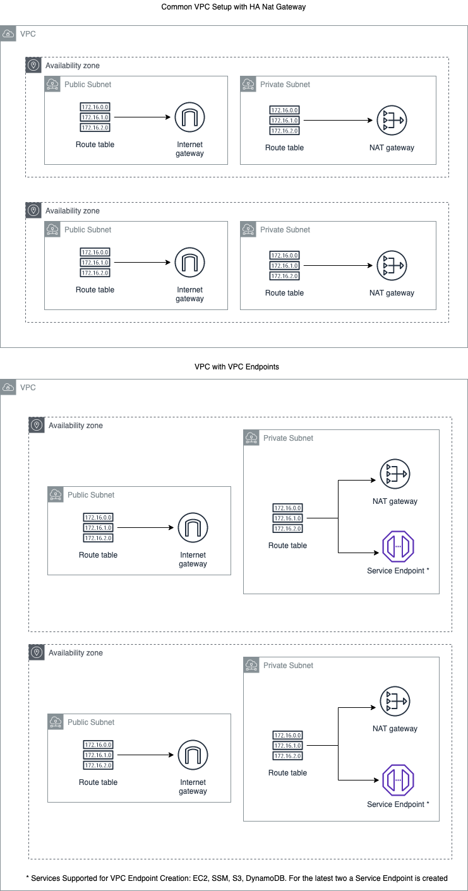

# devops-mod-aws-vpc

[](https://www.terraform.io)

> Module that allows the creation of a VPC and its dependencies.
>
> Developed with all :heart: in the world by Sergio Hernandez Leon

Terraform module which creates VPC resources on AWS.

These types of resources are supported:

* [VPC](https://www.terraform.io/docs/providers/aws/r/vpc.html)
* [Subnet](https://www.terraform.io/docs/providers/aws/r/subnet.html)
* [Route](https://www.terraform.io/docs/providers/aws/r/route.html)
* [Route table](https://www.terraform.io/docs/providers/aws/r/route_table.html)
* [Internet Gateway](https://www.terraform.io/docs/providers/aws/r/internet_gateway.html)
* [NAT Gateway](https://www.terraform.io/docs/providers/aws/r/nat_gateway.html)
* [VPN Gateway](https://www.terraform.io/docs/providers/aws/r/vpn_gateway.html)
* [VPC Endpoint](https://www.terraform.io/docs/providers/aws/r/vpc_endpoint.html) (Gateway: S3, DynamoDB; Interface: EC2, SSM)
* [RDS DB Subnet Group](https://www.terraform.io/docs/providers/aws/r/db_subnet_group.html)
* [DHCP Options Set](https://www.terraform.io/docs/providers/aws/r/vpc_dhcp_options.html)
* [Default VPC](https://www.terraform.io/docs/providers/aws/r/default_vpc.html)

## Diagram



## Prerequisites

You will need the following things properly installed on your computer.

- [Git](http://git-scm.com/)
- [Terraform](https://www.terraform.io/downloads.html)

## Requirements

No requirements.

## Providers

| Name | Version |
|------|---------|
| aws  | n/a     |

## Inputs

| Name                                       | Description                                                                                                                                                                                                                             | Type     | Default                 | Required |
|--------------------------------------------|-----------------------------------------------------------------------------------------------------------------------------------------------------------------------------------------------------------------------------------------|----------|-------------------------|:--------:|
| amazon\_side\_asn                          | The Autonomous System Number (ASN) for the Amazon side of the gateway. By default the virtual private gateway is created with the current default Amazon ASN.                                                                           | `string` | `"64512"`               |    no    |
| assign\_generated\_ipv6\_cidr\_block       | Requests an Amazon-provided IPv6 CIDR block with a /56 prefix length for the VPC. You cannot specify the range of IP addresses, or the size of the CIDR block                                                                           | `bool`   | `false`                 |    no    |
| azs                                        | A list of availability zones in the region                                                                                                                                                                                              | `list`   | `[]`                    |    no    |
| cidr                                       | The CIDR block for the VPC. Default value is a valid CIDR, but not acceptable by AWS and should be overridden                                                                                                                           | `string` | `"0.0.0.0/0"`           |    no    |
| create\_database\_internet\_gateway\_route | Controls if an internet gateway route for public database access should be created                                                                                                                                                      | `bool`   | `false`                 |    no    |
| create\_database\_nat\_gateway\_route      | Controls if a nat gateway route should be created to give internet access to the database subnets                                                                                                                                       | `bool`   | `false`                 |    no    |
| create\_database\_subnet\_group            | Controls if database subnet group should be created                                                                                                                                                                                     | `bool`   | `true`                  |    no    |
| create\_database\_subnet\_route\_table     | Controls if separate route table for database should be created                                                                                                                                                                         | `bool`   | `false`                 |    no    |
| create\_eks\_nat\_gateway\_route           | Controls if a nat gateway route should be created to give internet access to the database subnets                                                                                                                                       | `bool`   | `false`                 |    no    |
| create\_eks\_subnet\_route\_table          | Controls if separate route table for eks should be created                                                                                                                                                                              | `bool`   | `false`                 |    no    |
| create\_elasticache\_subnet\_group         | Controls if elasticache subnet group should be created                                                                                                                                                                                  | `bool`   | `true`                  |    no    |
| create\_elasticache\_subnet\_route\_table  | Controls if separate route table for elasticache should be created                                                                                                                                                                      | `bool`   | `false`                 |    no    |
| create\_vpc                                | Controls if VPC should be created (it affects almost all resources)                                                                                                                                                                     | `bool`   | `true`                  |    no    |
| database\_route\_table\_tags               | Additional tags for the database route tables                                                                                                                                                                                           | `map`    | `{}`                    |    no    |
| database\_subnet\_group\_tags              | Additional tags for the database subnet group                                                                                                                                                                                           | `map`    | `{}`                    |    no    |
| database\_subnet\_suffix                   | Suffix to append to database subnets name                                                                                                                                                                                               | `string` | `"db"`                  |    no    |
| database\_subnet\_tags                     | Additional tags for the database subnets                                                                                                                                                                                                | `map`    | `{}`                    |    no    |
| database\_subnets                          | A list of database subnets                                                                                                                                                                                                              | `list`   | `[]`                    |    no    |
| default\_vpc\_enable\_classiclink          | Should be true to enable ClassicLink in the Default VPC                                                                                                                                                                                 | `bool`   | `false`                 |    no    |
| default\_vpc\_enable\_dns\_hostnames       | Should be true to enable DNS hostnames in the Default VPC                                                                                                                                                                               | `bool`   | `false`                 |    no    |
| default\_vpc\_enable\_dns\_support         | Should be true to enable DNS support in the Default VPC                                                                                                                                                                                 | `bool`   | `true`                  |    no    |
| default\_vpc\_name                         | Name to be used on the Default VPC                                                                                                                                                                                                      | `string` | `""`                    |    no    |
| default\_vpc\_tags                         | Additional tags for the Default VPC                                                                                                                                                                                                     | `map`    | `{}`                    |    no    |
| dhcp\_options\_domain\_name                | Specifies DNS name for DHCP options set                                                                                                                                                                                                 | `string` | `""`                    |    no    |
| dhcp\_options\_domain\_name\_servers       | Specify a list of DNS server addresses for DHCP options set, default to AWS provided                                                                                                                                                    | `list`   | [  "AmazonProvidedDNS"] |    no    |
| dhcp\_options\_netbios\_name\_servers      | Specify a list of netbios servers for DHCP options set                                                                                                                                                                                  | `list`   | `[]`                    |    no    |
| dhcp\_options\_netbios\_node\_type         | Specify netbios node\_type for DHCP options set                                                                                                                                                                                         | `string` | `""`                    |    no    |
| dhcp\_options\_ntp\_servers                | Specify a list of NTP servers for DHCP options set                                                                                                                                                                                      | `list`   | `[]`                    |    no    |
| dhcp\_options\_tags                        | Additional tags for the DHCP option set                                                                                                                                                                                                 | `map`    | `{}`                    |    no    |
| ec2\_endpoint\_private\_dns\_enabled       | Whether or not to associate a private hosted zone with the specified VPC for EC2 endpoint                                                                                                                                               | `bool`   | `false`                 |    no    |
| ec2\_endpoint\_security\_group\_ids        | The ID of one or more security groups to associate with the network interface for EC2 endpoint                                                                                                                                          | `list`   | `[]`                    |    no    |
| ec2\_endpoint\_subnet\_ids                 | The ID of one or more subnets in which to create a network interface for EC2 endpoint. Only a single subnet within an AZ is supported. If omitted, private subnets will be used.                                                        | `list`   | `[]`                    |    no    |
| eks\_route\_table\_tags                    | Additional tags for the eks route tables                                                                                                                                                                                                | `map`    | `{}`                    |    no    |
| eks\_subnet\_suffix                        | Suffix to append to eks subnets name                                                                                                                                                                                                    | `string` | `"eks"`                 |    no    |
| eks\_subnet\_tags                          | Additional tags for the eks subnets                                                                                                                                                                                                     | `map`    | `{}`                    |    no    |
| eks\_subnets                               | A list of eks subnets                                                                                                                                                                                                                   | `list`   | `[]`                    |    no    |
| elasticache\_route\_table\_tags            | Additional tags for the elasticache route tables                                                                                                                                                                                        | `map`    | `{}`                    |    no    |
| elasticache\_subnet\_suffix                | Suffix to append to elasticache subnets name                                                                                                                                                                                            | `string` | `"elasticache"`         |    no    |
| elasticache\_subnet\_tags                  | Additional tags for the elasticache subnets                                                                                                                                                                                             | `map`    | `{}`                    |    no    |
| elasticache\_subnets                       | A list of elasticache subnets                                                                                                                                                                                                           | `list`   | `[]`                    |    no    |
| enable\_dhcp\_options                      | Should be true if you want to specify a DHCP options set with a custom domain name, DNS servers, NTP servers, netbios servers, and/or netbios server type                                                                               | `bool`   | `false`                 |    no    |
| enable\_dns\_hostnames                     | Should be true to enable DNS hostnames in the VPC                                                                                                                                                                                       | `bool`   | `false`                 |    no    |
| enable\_dns\_support                       | Should be true to enable DNS support in the VPC                                                                                                                                                                                         | `bool`   | `true`                  |    no    |
| enable\_dynamodb\_endpoint                 | Should be true if you want to provision a DynamoDB endpoint to the VPC                                                                                                                                                                  | `bool`   | `false`                 |    no    |
| enable\_ec2\_endpoint                      | Should be true if you want to provision an EC2 endpoint to the VPC                                                                                                                                                                      | `bool`   | `false`                 |    no    |
| enable\_nat\_gateway                       | Should be true if you want to provision NAT Gateways for each of your private networks                                                                                                                                                  | `bool`   | `false`                 |    no    |
| enable\_s3\_endpoint                       | Should be true if you want to provision an S3 endpoint to the VPC                                                                                                                                                                       | `bool`   | `false`                 |    no    |
| enable\_ssm\_endpoint                      | Should be true if you want to provision an SSM endpoint to the VPC                                                                                                                                                                      | `bool`   | `false`                 |    no    |
| enable\_vpn\_gateway                       | Should be true if you want to create a new VPN Gateway resource and attach it to the VPC                                                                                                                                                | `bool`   | `false`                 |    no    |
| external\_nat\_ip\_ids                     | List of EIP IDs to be assigned to the NAT Gateways (used in combination with reuse\_nat\_ips)                                                                                                                                           | `list`   | `[]`                    |    no    |
| igw\_tags                                  | Additional tags for the internet gateway                                                                                                                                                                                                | `map`    | `{}`                    |    no    |
| instance\_tenancy                          | A tenancy option for instances launched into the VPC                                                                                                                                                                                    | `string` | `"default"`             |    no    |
| intra\_route\_table\_tags                  | Additional tags for the intra route tables                                                                                                                                                                                              | `map`    | `{}`                    |    no    |
| intra\_subnet\_tags                        | Additional tags for the intra subnets                                                                                                                                                                                                   | `map`    | `{}`                    |    no    |
| intra\_subnets                             | A list of intra subnets                                                                                                                                                                                                                 | `list`   | `[]`                    |    no    |
| manage\_default\_vpc                       | Should be true to adopt and manage Default VPC                                                                                                                                                                                          | `bool`   | `false`                 |    no    |
| map\_public\_ip\_on\_launch                | Should be false if you do not want to auto-assign public IP on launch                                                                                                                                                                   | `bool`   | `true`                  |    no    |
| name                                       | Name to be used on all the resources as identifier                                                                                                                                                                                      | `string` | `""`                    |    no    |
| nat\_eip\_tags                             | Additional tags for the NAT EIP                                                                                                                                                                                                         | `map`    | `{}`                    |    no    |
| nat\_gateway\_tags                         | Additional tags for the NAT gateways                                                                                                                                                                                                    | `map`    | `{}`                    |    no    |
| one\_nat\_gateway\_per\_az                 | Should be true if you want only one NAT Gateway per availability zone. Requires `var.azs` to be set, and the number of `public_subnets` created to be greater than or equal to the number of availability zones specified in `var.azs`. | `bool`   | `false`                 |    no    |
| one\_s3\_endpoint\_per\_az                 | Should be true if you want only one S3 Endpoint per private subnet. Requires `var.azs` to be set. | `bool`   | `false`                 |    no    |
| private\_route\_table\_tags                | Additional tags for the private route tables                                                                                                                                                                                            | `map`    | `{}`                    |    no    |
| private\_subnet\_suffix                    | Suffix to append to private subnets name                                                                                                                                                                                                | `string` | `"private"`             |    no    |
| private\_subnet\_tags                      | Additional tags for the private subnets                                                                                                                                                                                                 | `map`    | `{}`                    |    no    |
| private\_subnets                           | A list of private subnets inside the VPC                                                                                                                                                                                                | `list`   | `[]`                    |    no    |
| propagate\_private\_route\_tables\_vgw     | Should be true if you want route table propagation                                                                                                                                                                                      | `bool`   | `false`                 |    no    |
| propagate\_public\_route\_tables\_vgw      | Should be true if you want route table propagation                                                                                                                                                                                      | `bool`   | `false`                 |    no    |
| public\_route\_table\_tags                 | Additional tags for the public route tables                                                                                                                                                                                             | `map`    | `{}`                    |    no    |
| public\_subnet\_suffix                     | Suffix to append to public subnets name                                                                                                                                                                                                 | `string` | `"public"`              |    no    |
| public\_subnet\_tags                       | Additional tags for the public subnets                                                                                                                                                                                                  | `map`    | `{}`                    |    no    |
| public\_subnets                            | A list of public subnets inside the VPC                                                                                                                                                                                                 | `list`   | `[]`                    |    no    |
| reuse\_nat\_ips                            | Should be true if you don't want EIPs to be created for your NAT Gateways and will instead pass them in via the 'external\_nat\_ip\_ids' variable                                                                                       | `bool`   | `false`                 |    no    |
| secondary\_cidr\_blocks                    | List of secondary CIDR blocks to associate with the VPC to extend the IP Address pool                                                                                                                                                   | `list`   | `[]`                    |    no    |
| single\_nat\_gateway                       | Should be true if you want to provision a single shared NAT Gateway across all of your private networks                                                                                                                                 | `bool`   | `true`                  |    no    |
| ssm\_endpoint\_private\_dns\_enabled       | Whether or not to associate a private hosted zone with the specified VPC for SSM endpoint                                                                                                                                               | `bool`   | `false`                 |    no    |
| ssm\_endpoint\_security\_group\_ids        | The ID of one or more security groups to associate with the network interface for SSM endpoint                                                                                                                                          | `list`   | `[]`                    |    no    |
| ssm\_endpoint\_subnet\_ids                 | The ID of one or more subnets in which to create a network interface for SSM endpoint. Only a single subnet within an AZ is supported. If omitted, private subnets will be used.                                                        | `list`   | `[]`                    |    no    |
| tags                                       | A map of tags to add to all resources                                                                                                                                                                                                   | `map`    | `{}`                    |    no    |
| vpc\_tags                                  | Additional tags for the VPC                                                                                                                                                                                                             | `map`    | `{}`                    |    no    |
| vpn\_gateway\_id                           | ID of VPN Gateway to attach to the VPC                                                                                                                                                                                                  | `string` | `""`                    |    no    |
| vpn\_gateway\_tags                         | Additional tags for the VPN gateway                                                                                                                                                                                                     | `map`    | `{}`                    |    no    |

## Outputs

| Name                                        | Description                                                       |
|---------------------------------------------|-------------------------------------------------------------------|
| azs                                         | A list of availability zones specified as argument to this module |
| database\_route\_table\_ids                 | List of IDs of database route tables                              |
| database\_subnet\_group                     | ID of database subnet group                                       |
| database\_subnets                           | List of IDs of database subnets                                   |
| database\_subnets\_cidr\_blocks             | List of cidr\_blocks of database subnets                          |
| default\_network\_acl\_id                   | The ID of the default network ACL                                 |
| default\_route\_table\_id                   | The ID of the default route table                                 |
| default\_security\_group\_id                | The ID of the security group created by default on VPC creation   |
| default\_vpc\_cidr\_block                   | The CIDR block of the VPC                                         |
| default\_vpc\_default\_network\_acl\_id     | The ID of the default network ACL                                 |
| default\_vpc\_default\_route\_table\_id     | The ID of the default route table                                 |
| default\_vpc\_default\_security\_group\_id  | The ID of the security group created by default on VPC creation   |
| default\_vpc\_enable\_dns\_hostnames        | Whether or not the VPC has DNS hostname support                   |
| default\_vpc\_enable\_dns\_support          | Whether or not the VPC has DNS support                            |
| default\_vpc\_id                            | The ID of the VPC                                                 |
| default\_vpc\_instance\_tenancy             | Tenancy of instances spin up within VPC                           |
| default\_vpc\_main\_route\_table\_id        | The ID of the main route table associated with this VPC           |
| igw\_id                                     | The ID of the Internet Gateway                                    |
| intra\_route\_table\_ids                    | List of IDs of intra route tables                                 |
| intra\_subnets                              | List of IDs of intra subnets                                      |
| intra\_subnets\_cidr\_blocks                | List of cidr\_blocks of intra subnets                             |
| nat\_ids                                    | List of allocation ID of Elastic IPs created for AWS NAT Gateway  |
| nat\_public\_ips                            | List of public Elastic IPs created for AWS NAT Gateway            |
| natgw\_ids                                  | List of NAT Gateway IDs                                           |
| private\_route\_table\_ids                  | List of IDs of private route tables                               |
| private\_subnets                            | List of IDs of private subnets                                    |
| private\_subnets\_cidr\_blocks              | List of cidr\_blocks of private subnets                           |
| public\_route\_table\_ids                   | List of IDs of public route tables                                |
| public\_subnets                             | List of IDs of public subnets                                     |
| public\_subnets\_cidr\_blocks               | List of cidr\_blocks of public subnets                            |
| vgw\_id                                     | The ID of the VPN Gateway                                         |
| vpc\_cidr\_block                            | The CIDR block of the VPC                                         |
| vpc\_enable\_dns\_hostnames                 | Whether or not the VPC has DNS hostname support                   |
| vpc\_enable\_dns\_support                   | Whether or not the VPC has DNS support                            |
| vpc\_endpoint\_dynamodb\_id                 | The ID of VPC endpoint for DynamoDB                               |
| vpc\_endpoint\_dynamodb\_pl\_id             | The prefix list for the DynamoDB VPC endpoint.                    |
| vpc\_endpoint\_ec2\_dns\_entry              | The DNS entries for the VPC Endpoint for EC2.                     |
| vpc\_endpoint\_ec2\_id                      | The ID of VPC endpoint for EC2                                    |
| vpc\_endpoint\_ec2\_network\_interface\_ids | One or more network interfaces for the VPC Endpoint for EC2       |
| vpc\_endpoint\_s3\_id                       | The ID of VPC endpoint for S3                                     |
| vpc\_endpoint\_s3\_pl\_id                   | The prefix list for the S3 VPC endpoint.                          |
| vpc\_endpoint\_ssm\_dns\_entry              | The DNS entries for the VPC Endpoint for SSM.                     |
| vpc\_endpoint\_ssm\_id                      | The ID of VPC endpoint for SSM                                    |
| vpc\_endpoint\_ssm\_network\_interface\_ids | One or more network interfaces for the VPC Endpoint for SSM.      |
| vpc\_id                                     | The ID of the VPC                                                 |
| vpc\_instance\_tenancy                      | Tenancy of instances spin up within VPC                           |
| vpc\_main\_route\_table\_id                 | The ID of the main route table associated with this VPC           |
| vpc\_secondary\_cidr\_blocks                | List of secondary CIDR blocks of the VPC                          |

# Example Usage

## Usage

```hcl
module "vpc" {
  source = "git@github.com:sergiohl1324/mod-aws-vpc.git "

  name = "my-vpc"
  cidr = "10.0.0.0/16"

  azs             = ["eu-west-1a", "eu-west-1b", "eu-west-1c"]
  private_subnets = ["10.0.1.0/24", "10.0.2.0/24", "10.0.3.0/24"]
  public_subnets  = ["10.0.101.0/24", "10.0.102.0/24", "10.0.103.0/24"]

  enable_nat_gateway = true
  enable_vpn_gateway = true

  tags = {
    Terraform = "true"
    Environment = "dev"
  }
}
```

## External NAT Gateway IPs

By default this module will provision new Elastic IPs for the VPC's NAT Gateways.
This means that when creating a new VPC, new IPs are allocated, and when that VPC is destroyed those IPs are released.
Sometimes it is handy to keep the same IPs even after the VPC is destroyed and re-created.
To that end, it is possible to assign existing IPs to the NAT Gateways.
This prevents the destruction of the VPC from releasing those IPs, while making it possible that a re-created VPC uses the same IPs.

To achieve this, allocate the IPs outside the VPC module declaration.
```hcl
resource "aws_eip" "nat" {
  count = 3

  vpc = true
}
```

Then, pass the allocated IPs as a parameter to this module.
```hcl
module "vpc" {
  source = "git@github.com:sergiohl1324/mod-aws-vpc.git "

  # The rest of arguments are omitted for brevity

  enable_nat_gateway  = true
  single_nat_gateway  = false
  reuse_nat_ips       = true                      # <= Skip creation of EIPs for the NAT Gateways
  external_nat_ip_ids = ["${aws_eip.nat.*.id}"]   # <= IPs specified here as input to the module
}
```

Note that in the example we allocate 3 IPs because we will be provisioning 3 NAT Gateways (due to `single_nat_gateway = false` and having 3 subnets).
If, on the other hand, `single_nat_gateway = true`, then `aws_eip.nat` would only need to allocate 1 IP.
Passing the IPs into the module is done by setting two variables `reuse_nat_ips = true` and `external_nat_ip_ids = ["${aws_eip.nat.*.id}"]`.

## NAT Gateway Scenarios

This module supports three scenarios for creating NAT gateways. Each will be explained in further detail in the corresponding sections.

* One NAT Gateway per subnet (default behavior)
    * `enable_nat_gateway = true`
    * `single_nat_gateway = false`
    * `one_nat_gateway_per_az = false`
* Single NAT Gateway
    * `enable_nat_gateway = true`
    * `single_nat_gateway = true`
    * `one_nat_gateway_per_az = false`
* One NAT Gateway per availability zone
    * `enable_nat_gateway = true`
    * `single_nat_gateway = false`
    * `one_nat_gateway_per_az = true`

If both `single_nat_gateway` and `one_nat_gateway_per_az` are set to `true`, then `single_nat_gateway` takes precedence.

### One NAT Gateway per subnet (default)

By default, the module will determine the number of NAT Gateways to create based on the the `max()` of the private subnet lists (`database_subnets`, `elasticache_subnets`, `private_subnets`). The module **does not** take into account the number of `intra_subnets`, since the latter are designed to have no Internet access via NAT Gateway.  For example, if your configuration looks like the following:

```hcl
database_subnets    = ["10.0.21.0/24", "10.0.22.0/24"]
private_subnets     = ["10.0.1.0/24", "10.0.2.0/24", "10.0.3.0/24", "10.0.4.0/24", "10.0.5.0/24"]
intra_subnets       = ["10.0.51.0/24", "10.0.52.0/24", "10.0.53.0/24"]
```

Then `3` NAT Gateways will be created since `3` private subnet CIDR blocks were specified.

### Single NAT Gateway

If `single_nat_gateway = true`, then all private subnets will route their Internet traffic through this single NAT gateway. The NAT gateway will be placed in the first public subnet in your `public_subnets` block.

### One NAT Gateway per availability zone

If `one_nat_gateway_per_az = true` and `single_nat_gateway = false`, then the module will place one NAT gateway in each availability zone you specify in `var.azs`. There are some requirements around using this feature flag:

* The variable `var.azs` **must** be specified.
* The number of public subnet CIDR blocks specified in `public_subnets` **must** be greater than or equal to the number of availability zones specified in `var.azs`. This is to ensure that each NAT Gateway has a dedicated public subnet to deploy to.

## "private" versus "intra" subnets

By default, if NAT Gateways are enabled, private subnets will be configured with routes for Internet traffic that point at the NAT Gateways configured by use of the above options.

If you need private subnets that should have no Internet routing (in the sense of [RFC1918 Category 1 subnets](https://tools.ietf.org/html/rfc1918)), `intra_subnets` should be specified. An example use case is configuration of AWS Lambda functions within a VPC, where AWS Lambda functions only need to pass traffic to internal resources or VPC endpoints for AWS services.
 
Since AWS Lambda functions allocate Elastic Network Interfaces in proportion to the traffic received ([read more](https://docs.aws.amazon.com/lambda/latest/dg/vpc.html)), it can be useful to allocate a large private subnet for such allocations, while keeping the traffic they generate entirely internal to the VPC.

You can add additional tags with `intra_subnet_tags` as with other subnet types.

## Conditional creation

Sometimes you need to have a way to create VPC resources conditionally but Terraform does not allow to use `count` inside `module` block, so the solution is to specify argument `create_vpc`.

```hcl
# This VPC will not be created
module "vpc" {
  source = "git@github.com:sergiohl1324/mod-aws-vpc.git "

  create_vpc = false
  # ... omitted
}
```

## Public access to RDS instances

Sometimes it is handy to have public access to RDS instances (it is not recommended for production) by specifying these arguments:

```hcl
  create_database_subnet_group           = true
  create_database_subnet_route_table     = true
  create_database_internet_gateway_route = true

  enable_dns_hostnames = true
  enable_dns_support   = true
```
